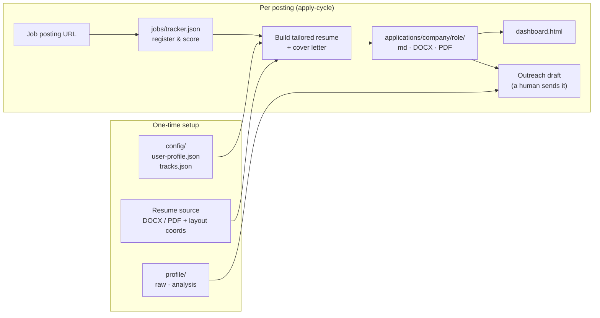
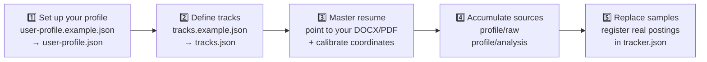
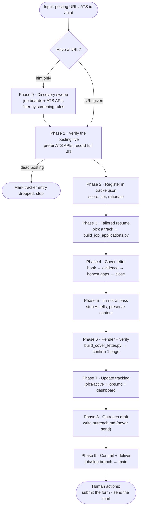
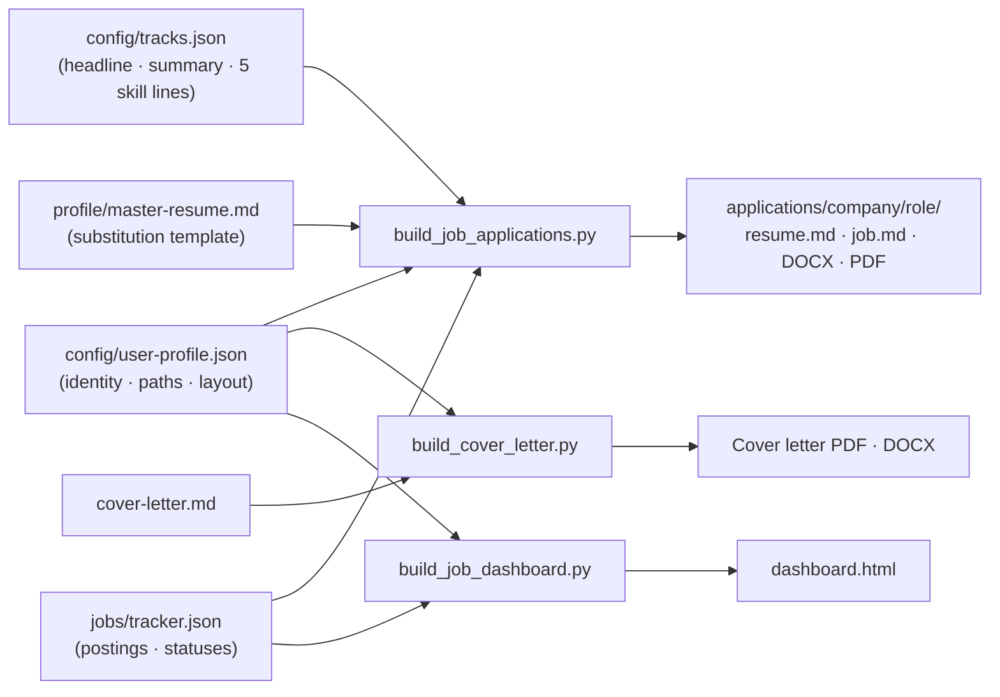

# where-is-my-job

An operations room for your job search — a template anyone can onboard onto with their own profile.

Collect postings, track them, generate track-based tailored resumes and cover letters, review everything on a dashboard, and (optionally) drive a fixture-only local automation service — all in one repository. Every piece of personal data lives in `config/` and `profile/`; nothing is hardcoded.

## The big picture



## Onboarding (do this once)

**Fastest path:** open the repo in Claude Code and run `/initial-setup`. It interviews you (positions, keywords, target city, work authorization, salary anchors, resume sources), generates all three config files, calibrates the PDF layout with you, and verifies the result. The manual path is below.



1. **Set up your profile** — copy `config/user-profile.example.json` to `config/user-profile.json` and fill in your name, contact details, target city, and screening rules. Every tool works with the example profile (Jane Doe) before you configure anything.
2. **Define your tracks** — copy `config/tracks.example.json` to `config/tracks.json`. A track is one positioning of your resume (headline + summary + five skill lines). Start with two to five tracks matched to the kinds of JDs you target.
3. **Master resume template** — prepare the DOCX/PDF source of your one-page resume and record the paths under `files` in `user-profile.json`. The builder never rebuilds the layout: it clones your source and replaces only the headline, summary, and five skill lines in place. Calibrate the text-region coordinates once in `resume_template_layout`. For the markdown version, copy `profile/master-resume.example.md` to `profile/master-resume.md` and fill in your experience.
4. **Accumulate sources** — resumes, portfolio notes, and memos go to `profile/raw/`; analysis (positioning, strengths/weaknesses) goes to `profile/analysis/`. The evidence arsenal for cover letters lives in `profile/analysis/positioning.md`.
5. **Replace the samples** — delete the Example Corp / Acme sample entries in `jobs/tracker.json` and register real postings.

Verify your setup at any point:

```bash
uv sync --group dev --group builders   # one-time environment setup
python3 tools/doctor.py                # health check: config, sources, fonts, tracker
python3 tools/calibrate_layout.py      # renders calibration-preview.png with the
                                       # configured text regions drawn over your PDF
```

Iterate on `resume_template_layout` in `config/user-profile.json` and re-run the calibrator until every box sits exactly over the matching region of your template.

## Structure

```
config/
  user-profile(.example).json  # identity, paths, layout, screening rules (the single point of personalization)
  tracks(.example).json        # resume positioning tracks
profile/
  raw/        # raw sources, kept verbatim as they arrive
  analysis/   # analysis derived from sources: strengths/weaknesses, positioning, narrative
  master-resume(.example).md   # markdown resume template ({{HEADLINE}} etc. substituted)
jobs/
  inbox/ active/ archived/     # posting lifecycle (one file per posting)
  jobs.md                      # human-readable priority digest
  tracker.json                 # canonical source of postings, scores, statuses
applications/
  <company>/<role>/            # job.md + resume.md + tailored DOCX/PDF
dashboard.html                 # search / filter / status dashboard (build artifact)
tools/                         # builders: resume, cover letter, dashboard + LinkedIn collector
application_automation/        # local fixture-only automation service (zero real-submission authority)
.claude/skills/apply-cycle/    # Claude Code skill defining one full application cycle
discussions/ interviews/       # decision records, interview prep
```

## One full cycle (`/apply-cycle`)



## Build data flow



## Day-to-day usage

```bash
# Full cycle from a single posting URL (inside Claude Code)
/apply-cycle <posting-url>

# Manual builds
python3 tools/build_job_applications.py <role-id>   # tailored resume (md/DOCX/PDF)
python3 tools/build_cover_letter.py <cover-letter.md> <output-dir>
python3 tools/build_job_dashboard.py && open dashboard.html

# Collect LinkedIn postings (no-login guest API)
bun tools/linkedin-jobs.ts search "frontend engineer" --location "Vancouver, BC"
```

Builder requirements: Python 3.11+ and the `builders` dependency group (`uv sync --group builders` installs PyMuPDF, `lxml`, `python-docx`, `reportlab`), plus the TTF fonts declared under `fonts` in `user-profile.json`.

Status changes made in the `file://` dashboard are stored only in that browser's `localStorage` scratch. Export them with "Export application statuses" before moving to another browser. The permanent source of truth for postings and statuses is `jobs/tracker.json`.

## Operating rules

1. Preserve every source verbatim in `profile/raw/`. Keep analysis separate in `analysis/` — never mix originals with interpretation.
2. Track each posting's lifecycle in a single file: `inbox → active → archived`. Update `jobs.md` on every move.
3. Version application materials per company directory. Derive from the master, and record what you changed and why.
4. Record discussions and decisions in `discussions/` so nothing gets debated twice.
5. If you keep this repository **private**, you may version `config/user-profile.json` and `config/tracks.json` (remove those lines from `.gitignore`). If it is public, never commit them.

## Local application automation (optional)

The current runtime is deterministic-fixture only. `serve`, `queue`, `worker`, and `recover` all require `--fixture`, and there is **zero** authority to submit to real providers. Fixture/sandbox successes, dashboard statuses, and exports are not evidence of real submissions.

- [Current fixture operations and status semantics](docs/application-automation.md)
- [Aside-only context and the human login procedure](docs/aside-setup.md)
- [Current scope of status, projection, and cutover](docs/status-cutover.md)
- [Threat model and security boundaries](docs/application-automation-threat-model.md)

Known limitation: the automation package's batch policy is currently pinned to the `America/Vancouver` timezone and a Vancouver-area location list (including CHECK constraints in the SQL migrations). Retargeting another region requires editing `application_automation/policy.py`, `models.py`, `store.py`, and `migrations/` together. Everything else — dashboard, builders, the skill — is region-agnostic.

Tests: `pytest tests` runs green on a fresh clone (CI enforces it). A set of inherited fixture-adapter failures is quarantined as `xfail` via `tests/application_automation/known_failures.txt`; fix one and remove its line to bring it back into the count.

Approved resumes and application materials may live in the repository. Credentials, session secrets, bootstrap tokens, raw assertion values, and provider payloads never do. CAPTCHA/MFA is never automated or bypassed.
