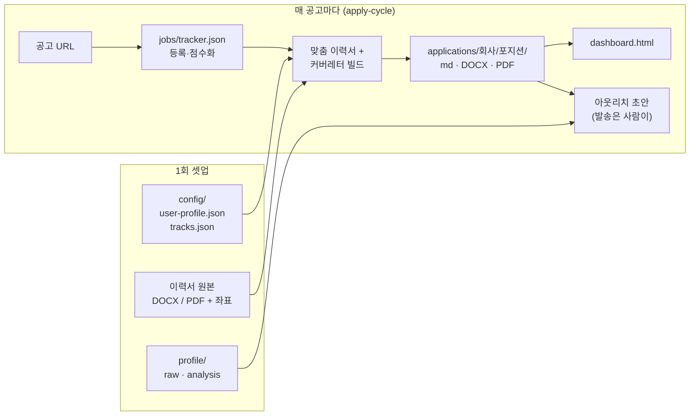
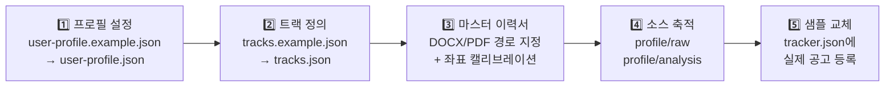
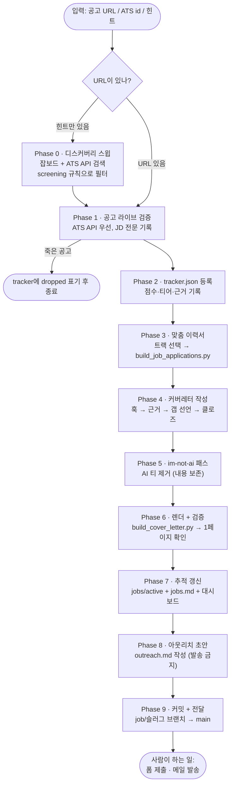
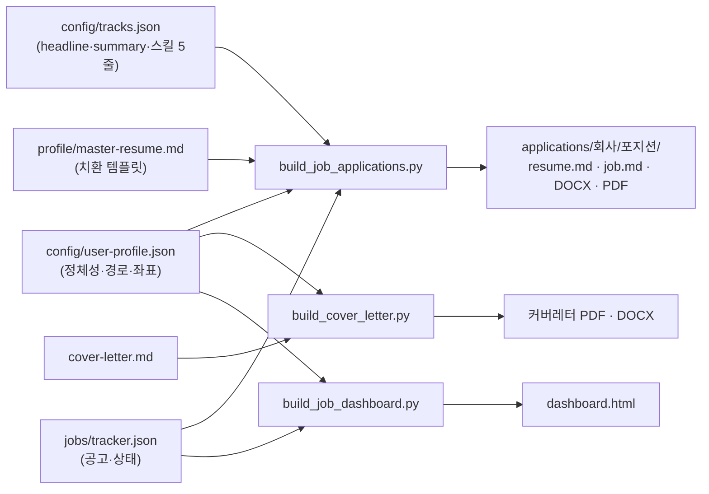

# where-is-my-job

직장 구할 때까지 토론·분석·실행하는 작전실 — 누구나 자기 프로필로 온보딩해서 쓸 수 있는 템플릿.

공고 수집 → 추적 → 트랙 기반 맞춤 이력서/커버레터 생성 → 대시보드 → (fixture 전용) 로컬 자동화까지 한 리포에서 굴린다. 개인 정보는 전부 `config/`와 `profile/`에 모여 있고, 코드에는 하드코딩이 없다.

## 전체 그림



## 온보딩 (처음 하는 일)



1. **프로필 설정** — `config/user-profile.example.json`을 `config/user-profile.json`으로 복사하고 이름·연락처·타겟 도시·스크리닝 규칙을 채운다. 설정 전에도 모든 도구는 예시 프로필(Jane Doe)로 동작한다.
2. **트랙 정의** — `config/tracks.example.json`을 `config/tracks.json`으로 복사. 트랙 = 이력서의 한 가지 포지셔닝(headline + summary + 스킬 5줄). JD 성향별로 2~5개 정도로 시작.
3. **마스터 이력서 템플릿** — 원페이지 이력서의 DOCX/PDF 원본을 준비하고 경로를 `user-profile.json`의 `files`에 적는다. 빌더는 레이아웃을 다시 만들지 않고, 원본에서 headline/summary/스킬 5줄 텍스트 영역만 교체한다. 영역 좌표는 `resume_template_layout`에서 1회 캘리브레이션. 마크다운 버전은 `profile/master-resume.example.md` → `profile/master-resume.md`로 복사해 경력 섹션을 채운다.
4. **소스 축적** — 이력서·포트폴리오·메모를 `profile/raw/`에, 분석(포지셔닝·강약점)을 `profile/analysis/`에. 커버레터의 근거 아스널은 `profile/analysis/positioning.md`.
5. **샘플 데이터 교체** — `jobs/tracker.json`의 Example Corp / Acme 샘플을 지우고 실제 공고를 등록한다.

## 구조

```
config/
  user-profile(.example).json  # 정체성·경로·레이아웃·스크리닝 규칙 (유일한 개인화 지점)
  tracks(.example).json        # 이력서 포지셔닝 트랙
profile/
  raw/        # 원본 소스 (던져주는 대로 축적)
  analysis/   # 소스 기반 분석: 강점/약점, 포지셔닝, 내러티브
  master-resume(.example).md   # 마크다운 이력서 템플릿 ({{HEADLINE}} 등 치환)
jobs/
  inbox/ active/ archived/     # 공고 라이프사이클 (파일 하나로 추적)
  jobs.md                      # 사람용 우선순위 요약
  tracker.json                 # 공고·점수·상태의 canonical 원본
applications/
  <회사>/<포지션>/              # job.md + resume.md + 맞춤 DOCX/PDF
dashboard.html                 # 검색·필터·상태 변경 대시보드 (빌드 산출물)
tools/                         # 빌더: 이력서/커버레터/대시보드 + LinkedIn 수집기
application_automation/        # 로컬 fixture 전용 자동화 서비스 (실제 제출 권한 0)
.claude/skills/apply-cycle/    # 한 사이클 전체를 정의한 Claude Code 스킬
discussions/ interviews/       # 의사결정 기록, 면접 준비
```

## 한 사이클의 흐름 (`/apply-cycle`)



## 빌드 데이터 흐름



## 일상 사용

```bash
# 공고 URL 하나로 전체 사이클 (Claude Code에서)
/apply-cycle <posting-url>

# 수동 빌드
python3 tools/build_job_applications.py <role-id>   # 맞춤 이력서 (md/DOCX/PDF)
python3 tools/build_cover_letter.py <cover-letter.md> <output-dir>
python3 tools/build_job_dashboard.py && open dashboard.html

# LinkedIn 공고 수집 (비로그인 guest API)
bun tools/linkedin-jobs.ts search "frontend engineer" --location "Vancouver, BC"
```

빌더 요구사항: Python 3.11+, PyMuPDF(`fitz`), `lxml`, `python-docx`, `reportlab`, 그리고 `user-profile.json`의 `fonts`에 지정한 TTF 폰트.

`file://` 대시보드에서 바꾼 상태는 해당 브라우저의 `localStorage` scratch에만 저장된다. 다른 브라우저로 옮기기 전 `지원 상태 내보내기`로 내보낸다. 공고와 기본 상태의 영구 원본은 `jobs/tracker.json`이다.

## 운영 규칙

1. 소스는 전부 `profile/raw/`에 원본 그대로 보존. 분석은 `analysis/`에 분리 — 원본과 해석을 섞지 않는다.
2. 공고는 파일 하나로 라이프사이클 추적: `inbox → active → archived`. 이동할 때 `jobs.md` 갱신.
3. 지원 자료는 회사별 디렉토리에서 버전 관리. 마스터에서 파생시키되 어디를 왜 바꿨는지 기록.
4. 논의/결정은 `discussions/`에 남긴다. 같은 얘기 두 번 안 하기 위해.
5. 이 리포를 private으로 유지한다면 `config/user-profile.json`·`config/tracks.json`을 버전 관리에 넣어도 된다(.gitignore에서 해당 줄 제거). public이라면 절대 커밋하지 않는다.

## 로컬 지원 자동화 (선택 기능)

현재 런타임은 결정론적 fixture 전용이다. `serve`, `queue`, `worker`, `recover`는 반드시 `--fixture`가 있어야 하며, 실제 제공자에게 제출할 권한은 **0**이다. fixture/sandbox 성공·대시보드 상태와 내보내기는 실제 지원 권한이나 제출 증거가 아니다.

- [현재 fixture 운영과 상태 의미](docs/application-automation.md)
- [Aside 전용 컨텍스트와 사람 로그인 절차](docs/aside-setup.md)
- [상태·projection·cutover의 현재 범위](docs/status-cutover.md)
- [위협 모델과 보안 경계](docs/application-automation-threat-model.md)

알려진 제약: 자동화 패키지의 배치 정책은 현재 `America/Vancouver` 타임존과 밴쿠버권 location 목록에 고정되어 있다(SQL 마이그레이션의 CHECK 제약 포함). 다른 지역으로 옮기려면 `application_automation/policy.py`, `models.py`, `store.py`와 `migrations/`를 함께 수정해야 한다. 대시보드·빌더·스킬 등 나머지 전부는 지역 무관하게 동작한다.

테스트: `pytest tests` 중 `application_automation` 스위트 일부가 현재 실패 상태로 알려져 있다(fixture 어댑터 개발 중). 빌더·대시보드·API 테스트는 통과한다.

승인된 이력서와 지원 자료는 저장소에 둘 수 있다. 반면 자격 증명, 세션 비밀, bootstrap 토큰, 원시 assertion 값, 제공자 payload는 저장소에 두지 않는다. CAPTCHA/MFA는 자동화하거나 우회하지 않는다.
